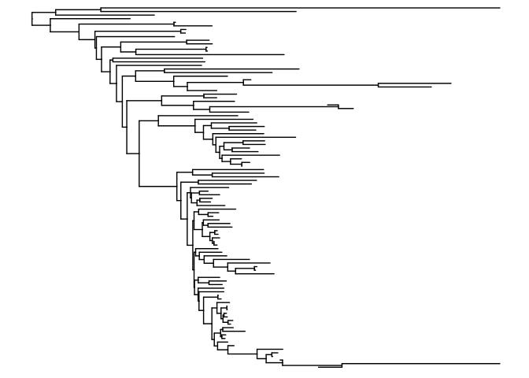
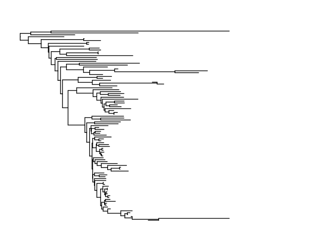
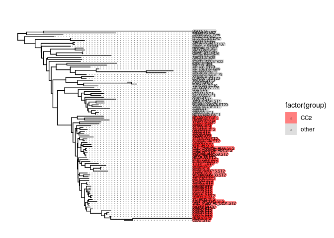
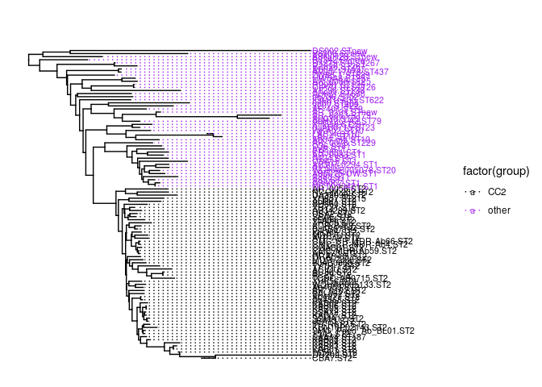
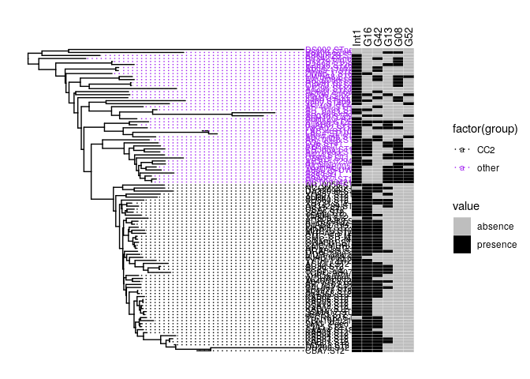

## Installing packages, for installing remove the

``` r
# if (!requireNamespace("BiocManager", quietly = TRUE))
#     install.packages("BiocManager")
#  
# BiocManager::install("ggtree")

#install.packages("ape")
#install.packages("ggplot2")
#install.packages("phylotools")
#install.packages("dplyr")
#install.packages("tidytree")
#install.packages("phytools")
```

## Uploading packages

``` r
library(ape)
library(ggplot2)
library(ggtree)
```

    ## Registered S3 method overwritten by 'treeio':
    ##   method     from
    ##   root.phylo ape

    ## ggtree v2.2.4  For help: https://yulab-smu.github.io/treedata-book/
    ## 
    ## If you use ggtree in published research, please cite the most appropriate paper(s):
    ## 
    ## - Guangchuang Yu. Using ggtree to visualize data on tree-like structures. Current Protocols in Bioinformatics, 2020, 69:e96. doi:10.1002/cpbi.96
    ## - Guangchuang Yu, Tommy Tsan-Yuk Lam, Huachen Zhu, Yi Guan. Two methods for mapping and visualizing associated data on phylogeny using ggtree. Molecular Biology and Evolution 2018, 35(12):3041-3043. doi:10.1093/molbev/msy194
    ## - Guangchuang Yu, David Smith, Huachen Zhu, Yi Guan, Tommy Tsan-Yuk Lam. ggtree: an R package for visualization and annotation of phylogenetic trees with their covariates and other associated data. Methods in Ecology and Evolution 2017, 8(1):28-36. doi:10.1111/2041-210X.12628

    ## 
    ## Attaching package: 'ggtree'

    ## The following object is masked from 'package:ape':
    ## 
    ##     rotate

``` r
library(phylotools)
library(dplyr)
```

    ## 
    ## Attaching package: 'dplyr'

    ## The following objects are masked from 'package:stats':
    ## 
    ##     filter, lag

    ## The following objects are masked from 'package:base':
    ## 
    ##     intersect, setdiff, setequal, union

``` r
library(tidytree)
```

    ## 
    ## Attaching package: 'tidytree'

    ## The following object is masked from 'package:stats':
    ## 
    ##     filter

``` r
library(phytools)
```

    ## Loading required package: maps

## Reading the tree and quick plot of the tree (this is a example for Acinetobacter baumannii \[obtained from public database\], in this case the tree was build using the free alignment approach )

``` r
tree <- read.tree("wholegenome_acitenobacter.nwk")
tree2<-midpoint.root(tree) #rotting the tree by the midpoint 
length(tree2$tip.label)
```

    ## [1] 101

``` r
ggtree(tree2, ladderize=FALSE)
```

 \#\#
Renaming the tip label using the file where there is a old (1st column)
and new name (2nd column)

``` r
data<-read.table("rename_tip.label.txt", header = TRUE, sep = "\t")
head(data)
```

    ##   old_name       new_name
    ## 1    DS002    DS002.STnew
    ## 2    B8300    B8300.STnew
    ## 3       28  ABNIH28.STnew
    ## 4    B8342    B8342.STnew
    ## 5  1279779 D1279779.ST267
    ## 6    R2090    R2090.ST267

``` r
tree3 <- sub.taxa.label(tree2, data) # renaming the tip label
tree3$tip.label
```

    ##   [1] "R2090.ST267"          "D1279779.ST267"       "B8342.STnew"         
    ##   [4] "ATCC 17978.ST437"     "AB042.ST437"          "ZW85-1.ST639"        
    ##   [7] "A1296.ST138"          "CIP70.10.ST126"       "R2091.ST126"         
    ##  [10] "AR_0088.ST25"         "HWBA8.ST25"           "ab736.ST52"          
    ##  [13] "AB031.ST638"          "IOMTU 433.ST622"      "AbH12O-A2.ST79"      
    ##  [16] "AB030.ST79"           "AR_0063.ST79"         "AR_0101.STnew"       
    ##  [19] "AF-401.ST79"          "3207.ST422"           "6200.ST464"          
    ##  [22] "Ab04-mff.ST10"        "LAC4.ST10"            "LAC-4.ST10"          
    ##  [25] "WKA02.ST10"           "BJAB0715.ST23"        "XH858.ST23"          
    ##  [28] "NCTC13421.ST1"        "AB0057.ST1"           "A85.ST1"             
    ##  [31] "A388.ST1"             "AB5075-UW.ST1"        "WCHAB005078.ST20"    
    ##  [34] "A1.ST1"               "AB307-0294.ST1"       "USA15.ST1"           
    ##  [37] "A424.ST1"             "AR_0083.ST1"          "KR3831.ST1"          
    ##  [40] "AYE.ST1"              "D36.ST81"             "AR_0078.ST229"       
    ##  [43] "DA33098.ST2"          "NCGM 237.ST2"         "AR_0056.ST2"         
    ##  [46] "AbPK1.ST2"            "XH857.ST215"          "15A34.ST2"           
    ##  [49] "SSA6.ST2"             "USA2.ST2"             "AB34299.ST2"         
    ##  [52] "XH731.ST2"            "XH860.ST2"            "AF-673.ST2"          
    ##  [55] "CMC-MDR-Ab59.ST2"     "ORAB01.ST2"           "CMC-CR-MDR-Ab4.ST2"  
    ##  [58] "CMC-CR-MDR-Ab66.ST2"  "AYP-A2.ST2"           "MDR-TJ.ST2"          
    ##  [61] "XH386.ST2"            "BJAB07104.ST2"        "XDR-BJ83.ST2"        
    ##  [64] "XH859.ST2"            "TCDC-AB0715.ST2"      "AC29.ST2"            
    ##  [67] "AC30.ST2"             "ACICU.ST2"            "TYTH-1.ST2"          
    ##  [70] "BJAB0868.ST2"         "MDR-ZJ06.ST2"         "HRAB-85.ST2"         
    ##  [73] "Ab4653.ST2"           "WCHAB005133.ST2"      "XH856.ST2"           
    ##  [76] "AR_0102.ST2"          "BAL062.ST2"           "Ab4568.ST2"          
    ##  [79] "Ab4977.ST2"           "JBA13.ST2"            "SSMA17.ST2"          
    ##  [82] "KAB07.ST2"            "SSA12.ST2"            "KAB05.ST2"           
    ##  [85] "KAB06.ST2"            "KAB02.ST2"            "15A5.ST2"            
    ##  [88] "SMC_Paed_Ab_BL01.ST2" "KBN10P02143.ST2"      "YU-R612.ST2"         
    ##  [91] "SAA14.ST187"          "KAB08.ST2"            "KAB04.ST2"           
    ##  [94] "KAB01.ST2"            "KAB03.ST2"            "1656-2.ST2"          
    ##  [97] "CBA7.ST2"             "DU202.ST2"            "ABNIH28.STnew"       
    ## [100] "B8300.STnew"          "DS002.STnew"

## Importing the metadata

``` r
meta_data = read.csv("meta_data.csv", sep=",", row.names=1) 
head(meta_data)
```

    ##                    Int1     G16      G42      G13      G08     G52     G24
    ## DS002.STnew     absence absence  absence  absence  absence absence absence
    ## B8300.STnew     absence absence  absence presence presence absence absence
    ## ABNIH28.STnew  presence absence  absence  absence  absence absence absence
    ## B8342.STnew    presence absence presence  absence presence absence absence
    ## D1279779.ST267 presence absence  absence  absence presence absence absence
    ## R2090.ST267    presence absence  absence presence presence absence absence
    ##                    G59      G31     G50     G61     G22     G09     G62    Int3
    ## DS002.STnew    absence  absence absence absence absence absence absence absence
    ## B8300.STnew    absence  absence absence absence absence absence absence absence
    ## ABNIH28.STnew  absence  absence absence absence absence absence absence absence
    ## B8342.STnew    absence presence absence absence absence absence absence absence
    ## D1279779.ST267 absence  absence absence absence absence absence absence absence
    ## R2090.ST267    absence  absence absence absence absence absence absence absence
    ##                   Int2
    ## DS002.STnew    absence
    ## B8300.STnew    absence
    ## ABNIH28.STnew  absence
    ## B8342.STnew    absence
    ## D1279779.ST267 absence
    ## R2090.ST267    absence

``` r
meta_group = read.table("group.txt", sep = "\t",header = TRUE, stringsAsFactors = FALSE)
head(meta_group)
```

    ##             code group
    ## 1    DS002.STnew other
    ## 2    B8300.STnew other
    ## 3  ABNIH28.STnew other
    ## 4    B8342.STnew other
    ## 5 D1279779.ST267 other
    ## 6    R2090.ST267 other

## Plotting the tree and tip label with different colors

``` r
p<-ggtree(tree3, ladderize=FALSE) + ylim(0,110) + xlim(0,0.01) + geom_treescale(x=0.01, y=1, offset=1)
```

    ## Scale for 'y' is already present. Adding another scale for 'y', which will
    ## replace the existing scale.

``` r
p
```



``` r
#1st option
p2<-p %<+% meta_group + scale_fill_manual(values = c("CC2"="red","other"="grey")) +
  geom_tiplab(aes(fill = factor(group)), size=2,
              color = "black", # color for label font
              geom = "label",  # label, not text
              label.padding = unit(0.05, "lines"), # amount of padding around the labels
              label.size = 0,alpha=.5, align = TRUE)# size of label border
```

    ## Warning: Duplicated aesthetics after name standardisation: size

    ## Warning: Ignoring unknown parameters: label.padding, label.size

``` r
p2
```



``` r
#2nd option
p3<-p %<+% meta_group + geom_tiplab(aes(color = factor(group),fontface="bold"),align=TRUE, size=2.8) + scale_color_manual(values = c("CC2"="black","other"="purple"))                
```

    ## Warning: Duplicated aesthetics after name standardisation: size

``` r
p3
```



## Plotting the tree with the metadata

``` r
hm <- gheatmap(p3,meta_data, offset = 0.0011, width=0.6, font.size=3.5, colnames_position= "top", colnames_angle = 90, colnames_offset_y = 0, hjust = 0) + scale_fill_manual(values=c("presence" = "black", "absence" = "gray"))      
```

    ## Scale for 'fill' is already present. Adding another scale for 'fill', which
    ## will replace the existing scale.

``` r
hm
```

    ## Warning: Removed 1010 rows containing missing values (geom_tile).

    ## Warning: Removed 10 rows containing missing values (geom_text).



``` r
png(filename = "WGtree_acitenobacter.png", height = 14, width = 16, units = "in", res = 300)
plot(hm)
```

    ## Warning: Removed 1010 rows containing missing values (geom_tile).

    ## Warning: Removed 10 rows containing missing values (geom_text).

``` r
dev.off()
```

    ## png 
    ##   2

Note that the `echo = FALSE` parameter was added to the code chunk to
prevent printing of the R code that generated the plot.
